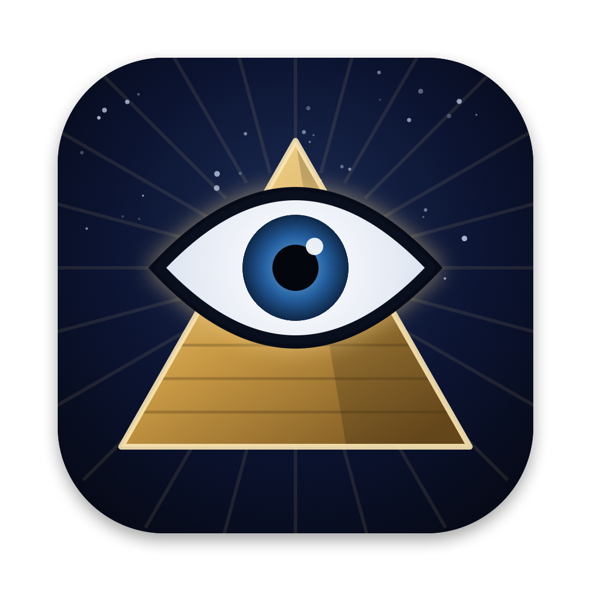

<p align="center"></p>

<h1 align="center">zeroCortisol</h1>

<p align="center"><b>Eleven dead philosophers live in your menu bar.<br>They argue so you don't have to.</b></p>

<p align="center">
  <code>curl -fsSL https://raw.githubusercontent.com/gigacook/zeroCortisol/main/install.sh | bash</code>
</p>

---

> *"This world is mere change, and this life, opinion."*
> — **Marcus Aurelius**

> *"I swear, gentlemen, that to be too conscious is an illness—a real thorough-going illness."*
> — **Dostoevsky**

> *"Man is something that is to be surpassed. What have ye done to surpass man?"*
> — **Nietzsche**

---

## 👁 What happens

Click the eye. It opens.

**Truth of the Day.** Every morning, one line from Epictetus, Marcus Aurelius, Socrates, Plato, Dostoevsky, Tolstoy, Kierkegaard, Kafka, Machiavelli, Nietzsche or the Preacher of Ecclesiastes. 407 passages, all quoted word for word. Pin the ones that hit.

**Four taps, day locked.** Mood → Sleep → Strength → Stillness, each 1–9. On the last tap the row *snaps* shut:

```
M:7 Sl:6 St:8 Sti:9
Streak: 12 | Total: 40
```

**Strength and Stillness count double.** The score rewards what you *do*, not just how you feel.

**A forgiving trajectory.** Good days pull your trend line up fast. Bad days barely dent it. One rough Tuesday isn't a pattern.

**Your constellation.** Hit *I am lucky*: the first time each day, today's Truth rises full screen behind an opening eye, then your pins become stars in a dark sea: authors → works → the lines you kept. A sidebar hands you posters of the books you haven't touched yet from the thinkers you pin most.

## 🔺 Get it

**One line** (macOS 14+; needs Command Line Tools, no Xcode):

```bash
curl -fsSL https://raw.githubusercontent.com/gigacook/zeroCortisol/main/install.sh | bash
```

No Command Line Tools yet?

```bash
xcode-select --install
```

**Build it yourself:**

```bash
git clone https://github.com/gigacook/zeroCortisol.git && cd zeroCortisol
scripts/build_app.sh && open dist/ZeroCortisol.app
```

## 🌌 Handy one-liners

Open your constellation without clicking:

```bash
~/Applications/ZeroCortisol.app/Contents/MacOS/ZeroCortisol --export-web --open
```

Back up everything you've pinned and logged:

```bash
cp ~/Library/Application\ Support/ZeroCortisol/zc.sqlite ~/Desktop/zerocortisol-backup.sqlite
```

Read your last week of check-ins in the terminal:

```bash
sqlite3 -column -header ~/Library/Application\ Support/ZeroCortisol/zc.sqlite \
  "SELECT date, mood, sleep, strength, stillness, mood+sleep+2*strength+2*stillness AS score FROM daily_logs ORDER BY date DESC LIMIT 7;"
```

Uninstall (your data stays):

```bash
rm -rf ~/Applications/ZeroCortisol.app
```

## 🔒 Yours, and only yours

No account, no cloud, no analytics. Everything lives in one SQLite file on your Mac. Clearing your browser won't touch it.

<sub>Quotes are verbatim from public-domain translations. The app is unsigned: if macOS complains, right-click → Open.</sub>

## ☕ Support

Free, like the philosophers intended (Diogenes lived in a barrel). If your cortisol dropped even a little, you can buy me a coffee:

[](https://ko-fi.com/gigacook)
